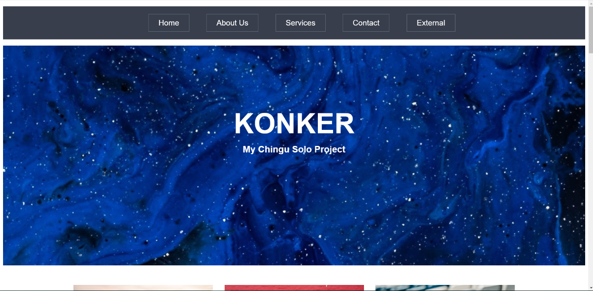

# Chingu Voyage Pre-work Project (Tier 1): Website Template

Konker is my Tier-1 solo project for Chingu Cohort Voyage 11 created with HTML5, CSS, and JavaScript(Vanilla).
It's a clone of a website template that was originally made using Bootstrap and Jquery.

## Installation Requirements
For development, you will only need to have a browser installed on your PC or MAC.
Just download and run in your local environment.

## Screenshots

## Tech Stack
Built with
    -HTML5
    -CSS3
    -JavaScript

## Deployment
You can see the deployed project on konker.netlify.com.

## Authors and Acknowledgement
This project is authored by Olufifun Adeleke

## License
MIT License

## Project Status
This project is complete, but not really. Feel free to fork and work on it.
Pull requests are welcome.